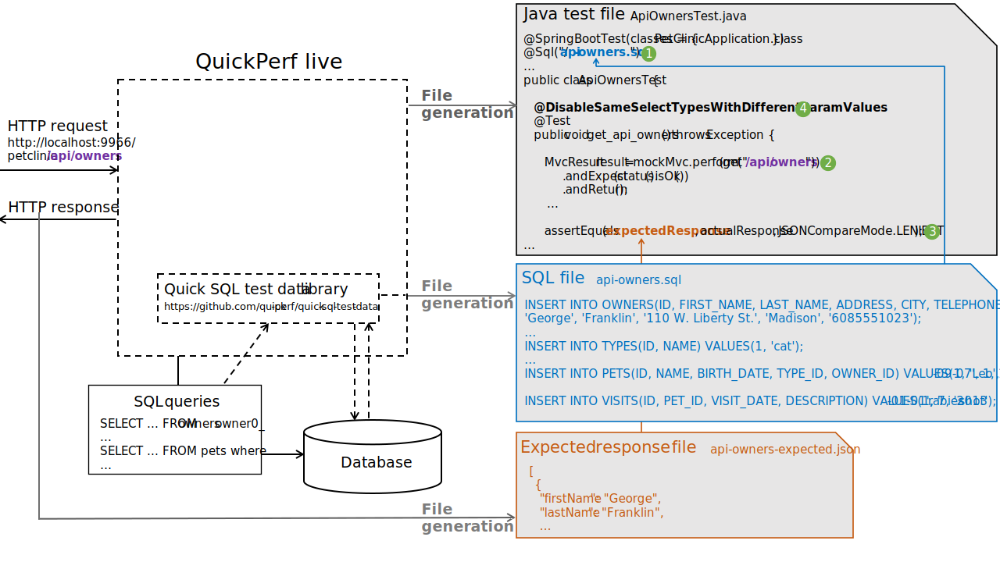

# Test generation

The test generation feature aims at producing automatic tests checking the functional behavior and performance-related properties.

Today, the test generation feature allows the creation of _Junit 4_ or _JUnit 5_ java test classes assuring a functional non-regression of _GET_ HTTP calls. In the future, this feature could also check the behavior of other HTTP calls (POST, PUT, ...); feel free to contribute to this open-source project! 
The generated tests also currently check the absence of N+1 selects. It may also verify other performance-related properties, such as the presence of a database connection leak. Once again, don't hesitate to contribute to _QuickPerf live_!

## Test generation process

### Generated files

_QuickPerf live_ generates three types of files during the test generation process:
* If the HHP call executes SQL queries, an SQL script file allowing to define a test dataset
* An expected response file
* A Java test class (_Junit 4_ or _JUnit 5_)

:mag_right: _Test generation log example_
```
INFO  QuickPerfHttpCallHttpCallInfoLogger - 
GET 200 http://localhost:9966/petclinic/api/owners
* TEST GENERATION
	* JUnit 5 test class: .\src\test\java\ApiOwnersTest.java
	* SQL script file: .\src\test\resources\api-owners.sql
	* Expected response: .\src\test\resources\api-owners-expected.json
```

_QuickPerf live_ produces a test Java class with one method verifying the functional behavior of the HTTP method call and the absence of N+1 select.


The following figure shows an example of generated files.


The generated Java test class performs several actions described below:
1. The test executes the INSERT statements contained in the generated SQL script file.
2. The test performs the HTTP call.
3. The test compares the response's content to the expected one contained in the response file.
   In the case of a JSON response, the project uses the [JSONassert library](https://github.com/skyscreamer/JSONassert) to compare the current response with the expected one.
4. The test verifies the absence of N+1 select with an annotation of the [QuickPerf testing library](https://github.com/quick-perf/quickperf).

### The test generation under the hood

The schema below can help to understand how the test generation works.



_QuickPerf live_ intercepts the SQL queries executed from an HTTP call. Then, it uses them to produce an SQL script file with the help of  the [Quick SQL test data](https://github.com/quick-perf/quick-sql-test-data) library. Finally, _QuickPerf live_ saves the script into a file.

The tool captures the HTTP response body and takes it to generate an expected response file (_JSON_, _HTML_, or _text_).

_QuickPerf live_ looks at the HTTP URL value to build the name of the generated files (_expected response_, _SQL_, _Java test class_).

## How to configure the test generation

### Configure the generation folders

💡 ***Tip*** If you use the library in your local environment, configure the generation in ```src/test/java``` and ```src/test/resources```  so that you can promptly execute the generated tests in your IDE!

:wrench: _.properties_ configuration example
```
quickperf.test-generation.java-folder-path=.\\src\\test\\resources
quickperf.test-generation.resource-folder-path=.\\src\\test\\java
```

:wrench: YAML configuration example
```yaml
quickperf:
  test-generation:
    java-folder-path: ".\\src\\test\\java"
    resource-folder-path: ".\\src\\test\\resources"
```

:wrench: MBean configuration
```
QuickPerf
  -- Test generation
      -- Operations
           -- String getJavaClassFolder()
           -- void setJavaClassFolder(String)
           -- String getTestResourceFolder()
           -- void setTestResourceFolder(String)
```

### Add dependencies to make the generated tests compile

To compile, you need to add the following dependencies:
* For REST API
```xml
<dependency>
  <groupId>org.skyscreamer</groupId>
  <artifactId>jsonassert</artifactId>
  <version>1.5.0</version>
  <scope>test</scope>
</dependency>
```

* For JUnit 5
```xml
<dependency>
  <groupId>org.quickperf</groupId>
  <artifactId>quick-perf-junit5</artifactId>
  <version>1.1.0</version>
  <scope>test</scope>
</dependency>
```

* For JUnit 4 & Spring 4
```xml
<dependency>
  <groupId>org.quickperf</groupId>
  <artifactId>quick-perf-junit4-spring4</artifactId>
  <version>1.1.0</version>
  <scope>test</scope>
</dependency>
```
* For JUnit 4 & Spring 5
```xml
<dependency>
  <groupId>org.quickperf</groupId>
  <artifactId>quick-perf-junit4-spring5</artifactId>
  <version>1.1.0</version>
  <scope>test</scope>
</dependency>
```

### Enable the test generation for JUnit 4

:wrench: _.properties_ configuration
```
quickperf.test-generation.junit4.enabled=true
```

:wrench: YAML configuration
```yaml
quickperf:
  test-generation:
    junit4:
      enabled: true
```

:wrench: MBean configuration
```
QuickPerf
  -- Test generation
      -- Operations
           -- boolean isJUnit4GenerationEnabled()
           -- void setJUnit4GenerationEnabled(true)
```

### Enable the test generation for JUnit 5

:wrench: _.properties_ configuration example
```
quickperf.test-generation.junit5.enabled=true
```

:wrench: YAML configuration
```yaml
quickperf:
  test-generation:
    junit5:
      enabled: true
```

:wrench: MBean configuration
```
QuickPerf
  -- Test generation
      -- Operations
           -- boolean isJUnit5GenerationEnabled()
           -- void setJUnit5GenerationEnabled(true)
```

